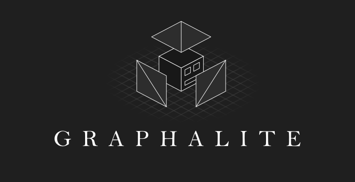

# About
Graphalite is a library to render Geometry Dash levels

# Usage
See: `index.html`

Event listeners will probably be moved in the Renderer or Camera classes.  
> [!IMPORTANT]  
> `loadLevel()` expects a un-b64 encoded un-gzipped level object string.  
> It should be semi-colon (;) delimited.

# Test
```sh
pnpm dev
```

# Credits
- IliasHDZ for making the OG [GDRW](https://github.com/iliasHDZ/GDRenderW) and the new [amazing update](https://github.com/iliasHDZ/GDRWeb) for reference
- Colon for sprite viewer which helped in development
- maxnut and GDRender contributors for object.json
- fig for answering my dumb questions

# License
This software is distributed under the MIT License